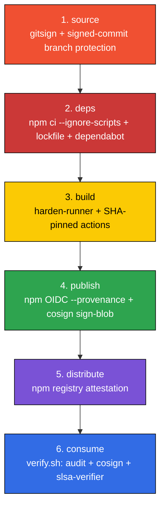

<div align="center">


# sigil

*every release under signature.*

[](https://securityscorecards.dev/viewer/?uri=github.com/0-draft/sigil)
[](https://github.com/0-draft/sigil/actions/workflows/ci.yml)
[](./LICENSE)

</div>

fork it. push. your release ships with sigstore signatures, slsa v1.0 provenance, and npm trusted publisher.
no `NPM_TOKEN`. no path to publish without provenance.

## the chain



if any link breaks, the next step refuses the input. that is the only behaviour.

## use this template

```bash
# 1. click "Use this template" on github
# 2. clone your new repo
git clone https://github.com/<you>/<your-repo>.git
cd <your-repo>

# 3. rename + sha-pin every action
./scripts/init.sh <your-org> <your-repo>

# 4. install + verify locally
npm ci
npm run check

# 5. configure npm trusted publisher on npmjs.com
#    settings -> packages -> add trusted publisher
#    repository:  <your-org>/<your-repo>
#    workflow:    .github/workflows/release.yml
#    environment: release
```

`init.sh` prints the `gh api` one-liner to apply branch protection. run it.

## verify a release (consumer side)

```bash
./scripts/verify.sh @<org>/<repo>@1.0.0
```

three independent proofs, three exit codes:

1. `npm audit signatures` — registry-served sigstore attestation
2. `cosign verify-blob` — workflow identity pinned via OIDC
3. `slsa-verifier verify-npm-package` — slsa v1.0 provenance

any one fails -> non-zero -> install rejected.

## see also

- [chainscope](https://github.com/0-draft/chainscope) for the conceptual map
- [docs/github-settings.md](./docs/github-settings.md) for the one-time UI hardening
- [docs/branch-protection.md](./docs/branch-protection.md) for the branch protection api call
- [SECURITY.md](./SECURITY.md) for vulnerability reporting
- [CONTRIBUTING.md](./CONTRIBUTING.md) for contributor rules
- [MIT](./LICENSE)
